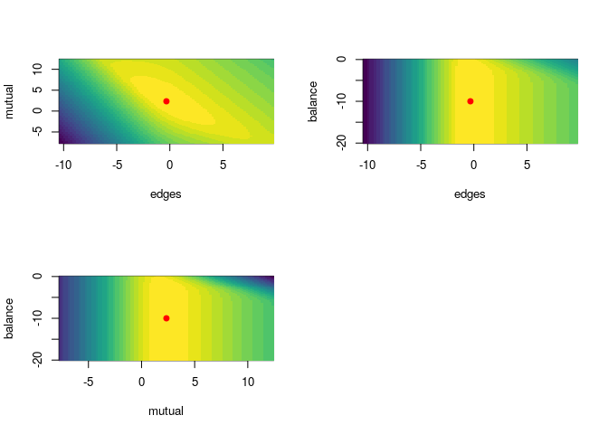

<!-- README.md is generated from README.Rmd. Please edit that file -->

# ergmito: Estimation of Little ‘ERGMs’ using exact likelihood

[](https://www.tidyverse.org/lifecycle/#experimental)
[](https://cran.r-project.org/package=ergmito)
[](https://travis-ci.org/muriteams/ergmito)
[](https://ci.appveyor.com/project/gvegayon/ergmito)
[](https://codecov.io/gh/muriteams/ergmito)

This R package, which has been developed on top of the amazing work that
the [Statnet](https://github.com/statnet) team has done, implements
estimation and simulation methods for Exponential Random Graph Models of
small networks, in particular, less than 7 nodes. In the case of small
networks, the calculation of the likelihood of ERGMs becomes
computationally feasible, which allows us avoiding approximations and do
exact calculation, ultimately obtaining MLEs directly.

## Support

This material is based upon work support by, or in part by, the U.S.
Army Research Laboratory and the U.S. Army Research Office under grant
number W911NF-15-1-0577

Computation for the work described in this paper was supported by the
University of Southern California’s Center for High-Performance
Computing (hpcc.usc.edu).

## Installation

The development version from [GitHub](https://github.com/) with:

``` r
# install.packages("devtools")
devtools::install_github("muriteams/ergmito")
```

## Example

An example from the manual

## When `ergm` is not enough

``` r
library(ergmito)
library(sna)

# Generating a small graph
set.seed(12)
n <- 4
net <- sna::rgraph(n, tprob = .7)
gplot(net)
```


``` r
model <- net ~ edges + mutual + balance

library(ergm)
ans_ergmito <- ergmito(model)
ans_ergm  <- ergm(model)

# The ergmito should have a larger value
ergm.exact(ans_ergmito$coef, model)
#>           [,1]
#> [1,] -6.557076
ergm.exact(ans_ergm$coef, model)
#>      [,1]
#> [1,]  NaN

summary(ans_ergmito)
#> $coefs
#>           Estimate Std. Error     z value  Pr(>|z|)
#> edges   -0.3203616   1.355221 -0.23639058 0.8131296
#> mutual   2.3390394   2.096539  1.11566695 0.2645647
#> balance -9.3678948 100.942647 -0.09280413 0.9260592
#> 
#> $aic
#> [1] 19.11415
#> 
#> $bic
#> [1] 20.56887
#> 
#> $model
#> [1] "net ~ edges + mutual + balance"
#> 
#> attr(,"class")
#> [1] "ergmito_summary"
summary(ans_ergm)
#> 
#> ==========================
#> Summary of model fit
#> ==========================
#> 
#> Formula:   net ~ edges + mutual + balance
#> 
#> Iterations:  2 out of 20 
#> 
#> Monte Carlo MLE Results:
#>          Estimate Std. Error MCMC % z value Pr(>|z|)    
#> edges    0.006341   1.209717      0   0.005    0.996    
#> mutual  20.682872         NA     NA      NA       NA    
#> balance      -Inf   0.000000      0    -Inf   <1e-04 ***
#> ---
#> Signif. codes:  0 '***' 0.001 '**' 0.01 '*' 0.05 '.' 0.1 ' ' 1
#> 
#>      Null Deviance: 16.64  on 12  degrees of freedom
#>  Residual Deviance:   NaN  on  9  degrees of freedom
#>  
#> AIC: NaN    BIC: NaN    (Smaller is better.) 
#> 
#>  Warning: The following terms have infinite coefficient estimates:
#>   balance
```

Checking convergence diagnostics

``` r
plot(ans_ergmito)
```



## Do we get the same?

``` r
# Generating a small graph
set.seed(12123)
n   <- 4
net <- sna::rgraph(n, tprob = .3)
gplot(net)
```


``` r
model <- net ~ edges + mutual

library(ergm)
ans_ergmito <- ergmito(model)
ans_ergm  <- ergm(model, control = control.ergm(
  MCMC.effectiveSize = 4000,
  seed = 444)
  )

# The ergmito should have a larger value
ergm.exact(ans_ergmito$coef, model) > ergm.exact(ans_ergm$coef, model)
#>      [,1]
#> [1,] TRUE

summary(ans_ergmito)
#> $coefs
#>         Estimate Std. Error    z value  Pr(>|z|)
#> edges  -1.098612   0.912871 -1.2034693 0.2287948
#> mutual  1.098612   1.825742  0.6017347 0.5473507
#> 
#> $aic
#> [1] 18.90944
#> 
#> $bic
#> [1] 19.87925
#> 
#> $model
#> [1] "net ~ edges + mutual"
#> 
#> attr(,"class")
#> [1] "ergmito_summary"
summary(ans_ergm)
#> 
#> ==========================
#> Summary of model fit
#> ==========================
#> 
#> Formula:   net ~ edges + mutual
#> 
#> Iterations:  2 out of 20 
#> 
#> Monte Carlo MLE Results:
#>        Estimate Std. Error MCMC % z value Pr(>|z|)
#> edges   -1.1003     0.9041      0  -1.217    0.224
#> mutual   1.1008     1.8194      0   0.605    0.545
#> 
#>      Null Deviance: 16.64  on 12  degrees of freedom
#>  Residual Deviance: 14.90  on 10  degrees of freedom
#>  
#> AIC: 18.9    BIC: 19.87    (Smaller is better.)
```

## Estimating data with known parameters

The following example shows the estimation of a dataset that is included
in the package, `fivenets`. This set of five networks was generated
using the `new_rergmito` function which allows creating a function to
draw random ERGMs with a fixed set of parameters, in this case, `edges =
-4` and `nodeicov("age") = .2`

``` r
data(fivenets)

model1 <- ergmito(fivenets ~ edges + nodeicov("age"))

summary(model1) # This data has know parameters equal to -4.0 and 0.2
#> $coefs
#>                Estimate Std. Error   z value   Pr(>|z|)
#> edges        -2.7746009 1.41036047 -1.967299 0.04914873
#> nodeicov.age  0.1471128 0.06596828  2.230054 0.02574388
#> 
#> $aic
#> [1] 80.09997
#> 
#> $bic
#> [1] 84.28865
#> 
#> $model
#> [1] "fivenets ~ edges + nodeicov(\"age\")"
#> 
#> attr(,"class")
#> [1] "ergmito_summary"
```

# Similarity indices

<https://cran.r-project.org/web/packages/proxy/proxy.pdf>

A Survey of Binary Similarity and Distance Measures Seung-Seok Choi,
Sung-Hyuk Cha, Charles C. Tappert Department of Computer Science, Pace
University New York, US

# Contributing

Please note that the ‘ergmito’ project is released with a [Contributor
Code of Conduct](CODE_OF_CONDUCT.md). By contributing to this project,
you agree to abide by its terms.
