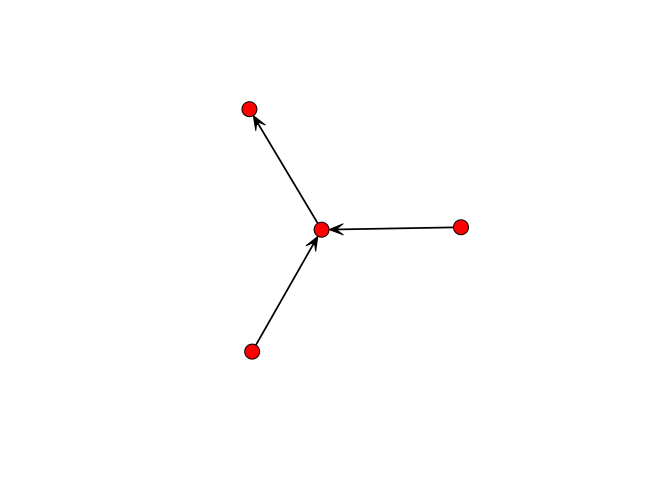
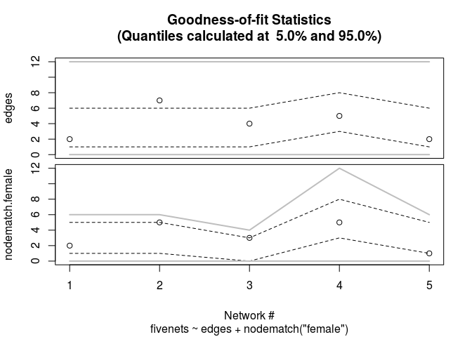

<!-- README.md is generated from README.Rmd. Please edit that file -->

# ergmito: Estimation of Little ‘ERGMs’ using exact likelihood 

[](https://www.tidyverse.org/lifecycle/#experimental)
[](https://cran.r-project.org/package=ergmito)
[](https://travis-ci.org/muriteams/ergmito)
[](https://ci.appveyor.com/project/gvegayon/ergmito)
[](https://codecov.io/gh/muriteams/ergmito)

This R package, which has been developed on top of the amazing work that
the [Statnet](https://github.com/statnet) team has done, implements
estimation and simulation methods for Exponential Random Graph Models of
small networks, in particular, less than 7 nodes. In the case of small
networks, the calculation of the likelihood of ERGMs becomes
computationally feasible, which allows us avoiding approximations and do
exact calculation, ultimately obtaining MLEs directly.

## Support

This material is based upon work support by, or in part by, the U.S.
Army Research Laboratory and the U.S. Army Research Office under grant
number W911NF-15-1-0577

Computation for the work described in this paper was supported by the
University of Southern California’s Center for High-Performance
Computing (hpcc.usc.edu).

## Citation

Vega Yon G (2019). *ergmito: Exponential Random Graph Models for Small
Networks*. R package version 0.1-1, \<URL:
<https://github.com/muriteams/ergmito>\>.

Vega Yon G, Slaughter A, de la Haye K (2019). “Exponential Random Graph
models for Little Networks.” arXiv:1904.10406.

To see these entries in BibTeX format, use ‘print(<citation>,
bibtex=TRUE)’, ‘toBibtex(.)’, or set ‘options(citation.bibtex.max=999)’.

## Installation

The development version from [GitHub](https://github.com/) with:

``` r
# install.packages("devtools")
devtools::install_github("muriteams/ergmito")
```

This requires compilation. Windows users can download the latest
compiled version from appveyor
[here](https://ci.appveyor.com/project/gvegayon/ergmito/build/artifacts).
The file to download is the one named `ergmito_[version number].zip`.
Once downloaded, you can install typing the following:

``` r
install.packages("[path to the zipfile]/ergmito_[version number].zip", repos = FALSE)
```

In the case of Mac users, and in particular, those with Mojave version,
they may need to install the following
<https://github.com/fxcoudert/gfortran-for-macOS/releases>

## Example

In the following example we simulate a small network with 4 vertices and
estimate the model parameters using `ergm` and `ergmito`. We start by
generating the graph

``` r
# Generating a small graph
library(ergmito)
library(ergm)
library(sna)

set.seed(12123)
n   <- 4
net <- rbernoulli(n, p = .3)
gplot(net)
```



To estimate the model

``` r
model <- net ~ edges + istar(2)

# ERGMito (estimation via MLE)
ans_ergmito <- ergmito(model)
```

``` r
# ERGM (estimation via MC-MLE)
ans_ergm  <- ergm(model, control = control.ergm(
  MCMC.effectiveSize = 4000,
  seed = 444)
  )

# The ergmito should have a larger value
ergm.exact(ans_ergmito$coef, model) > ergm.exact(ans_ergm$coef, model)
#>      [,1]
#> [1,] TRUE

summary(ans_ergmito)
#> 
#> ERGMito estimates
#> 
#> formula:  net ~ edges + istar(2) 
#> 
#>        Estimate Std. Error z value Pr(>|z|)
#> edges  -1.37749    1.00260 -1.3739   0.1695
#> istar2  0.50653    1.32701  0.3817   0.7027
#> AIC: 17.36312    BIC: 18.33294    (Smaller is better.)
summary(ans_ergm)
#> 
#> ==========================
#> Summary of model fit
#> ==========================
#> 
#> Formula:   net ~ edges + istar(2)
#> 
#> Iterations:  2 out of 20 
#> 
#> Monte Carlo MLE Results:
#>        Estimate Std. Error MCMC % z value Pr(>|z|)
#> edges   -1.4110     0.9995      0  -1.412    0.158
#> istar2   0.5607     1.3719      0   0.409    0.683
#> 
#>      Null Deviance: 16.64  on 12  degrees of freedom
#>  Residual Deviance: 13.35  on 10  degrees of freedom
#>  
#> AIC: 17.35    BIC: 18.32    (Smaller is better.)
```

## Estimating data with known parameters

The following example shows the estimation of a dataset that is included
in the package, `fivenets`. This set of five networks was generated
using the `new_rergmito` function which allows creating a function to
draw random ERGMs with a fixed set of parameters, in this case, `edges =
-2.0` and `nodematch("female") = 2.0`

``` r
data(fivenets)

model1 <- ergmito(fivenets ~ edges + nodematch("female"))

summary(model1) # This data has know parameters equal to -2.0 and 2.0
#> 
#> ERGMito estimates
#> 
#> formula:  fivenets ~ edges + nodematch("female") 
#> 
#>                  Estimate Std. Error z value Pr(>|z|)   
#> edges            -1.70475    0.54356 -3.1363 0.001711 **
#> nodematch.female  1.58697    0.64305  2.4679 0.013592 * 
#> ---
#> Signif. codes:  0 '***' 0.001 '**' 0.01 '*' 0.05 '.' 0.1 ' ' 1
#> AIC: 73.34109    BIC: 77.52978    (Smaller is better.)
```

We can also compute GOF

``` r
fivenets_gof <- gof_ergmito(model1)
fivenets_gof
#> 
#> Goodness-of-fit for edges 
#> 
#>       obs min mean max lower upper lower prob. upper prob.
#> net 1   2   0  3.7  12     0     6      0.0081        0.96
#> net 2   7   0  3.7  12     0     6      0.0081        0.96
#> net 3   4   0  3.1  12     0     6      0.0206        0.99
#> net 4   5   0  5.6  12     2     8      0.0309        0.95
#> net 5   2   0  3.7  12     0     6      0.0081        0.96
#> 
#> 
#> Goodness-of-fit for nodematch.female 
#> 
#>       obs min mean max lower upper lower prob. upper prob.
#> net 1   2   0  2.8   6     0     5       0.022        0.99
#> net 2   5   0  2.8   6     0     5       0.022        0.99
#> net 3   3   0  1.9   4     0     3       0.079        0.95
#> net 4   5   0  5.6  12     2     8       0.031        0.95
#> net 5   1   0  2.8   6     0     5       0.022        0.99
#> 
#> Note: Exact confidence intervals where used. This implies that the requestes CI may differ from the one used (see ?gof_ergmito).
plot(fivenets_gof)
```



## Fitting block-diagonal models

The pooled model can be also compared to a block-diagonal ERGM. The
package includes three functions to help with this task:
`blockdiagonalize`, `splitnetwork`, and `ergm_blockdiag`.

``` r

data("fivenets")

# Stacking matrices together
fivenets_blockdiag <- blockdiagonalize(fivenets, "block_id")
fivenets_blockdiag # It creates the 'block_id' variable
#>  Network attributes:
#>   vertices = 20 
#>   directed = TRUE 
#>   hyper = FALSE 
#>   loops = FALSE 
#>   multiple = FALSE 
#>   bipartite = FALSE 
#>   total edges= 20 
#>     missing edges= 0 
#>     non-missing edges= 20 
#> 
#>  Vertex attribute names: 
#>     block_id female name_original vertex.names 
#> 
#> No edge attributes
```

``` r
# Fitting the model with ERGM
ans0 <- ergm(
  fivenets_blockdiag ~ edges + nodematch("female"),
  constraints = ~ blockdiag("block_id")
  )
```

``` r
ans1 <- ergm_blockdiag(fivenets ~ edges + nodematch("female"))
```

``` r
# Now with ergmito
ans2 <- ergmito(fivenets ~ edges + nodematch("female"))

# All three are equivalent
cbind(
  ergm           = coef(ans0),
  ergm_blockdiag = coef(ans1),
  ergmito        = coef(ans2)
)
#>                       ergm ergm_blockdiag   ergmito
#> edges            -1.704748      -1.704748 -1.704748
#> nodematch.female  1.586965       1.586965  1.586965
```

The benefit of ergmito:

``` r
t_ergm <- system.time(ergm(
  fivenets_blockdiag ~ edges + nodematch("female") + ttriad,
  constraints = ~ blockdiag("block_id")
  ))
t_ergmito <- system.time(
  ergmito(fivenets ~ edges + nodematch("female")  + ttriad)
  )
```

``` r
# Relative elapsed time
(t_ergm/t_ergmito)[3]
#>  elapsed 
#> 110.6667
```

## Fitting a large model

Suppose that we have a large sample of small networks (ego from
Facebook, Twitter, etc.), 20,000 which account for 80,000 vertices:

``` r
set.seed(123)
bignet <- rbernoulli(sample(3:5, 20000, replace = TRUE))

# Number of vertices
sum(nvertex(bignet))
#> [1] 80089
```

We can fit this model in a memory efficient way.

``` r
system.time(ans0 <- ergmito(bignet ~ edges + mutual))
#>    user  system elapsed 
#>   8.208   0.037   8.251
summary(ans0)
#> 
#> ERGMito estimates
#> 
#> formula:  bignet ~ edges + mutual 
#> 
#>          Estimate Std. Error z value Pr(>|z|)
#> edges  -0.0021702  0.0068674 -0.3160    0.752
#> mutual -0.0015521  0.0112247 -0.1383    0.890
#> AIC: 352097.2    BIC: 352118.1    (Smaller is better.)
```

# Contributing

Please note that the ‘ergmito’ project is released with a [Contributor
Code of Conduct](CODE_OF_CONDUCT.md). By contributing to this project,
you agree to abide by its terms.
