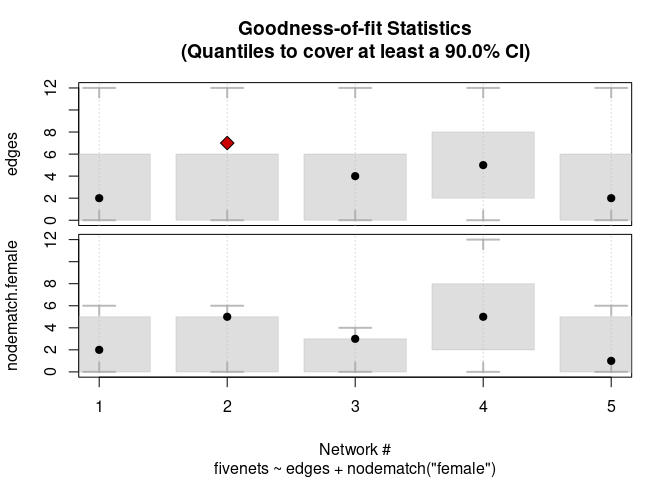

<!-- README.md is generated from README.Rmd. Please edit that file -->

# ergmito: Exponential Random Graph Models for Small Networks 

<!-- badges: start -->
<!-- [](https://CRAN.R-project.org/package=ergmito) -->

[](https://cran.r-project.org/package=ergmito)
[](https://www.tidyverse.org/lifecycle/#maturing)
[](https://travis-ci.org/muriteams/ergmito)
[](https://codecov.io/gh/muriteams/ergmito)

[](https://github.com/muriteams/ergmito/actions/workflows/R-CMD-check.yaml)
<!-- badges: end -->

This R package (which has been developed on top of the fantastic work
that the [Statnet](https://github.com/statnet) team has done) implements
estimation and simulation methods for Exponential Random Graph Models of
small networks, in particular, up to 5 vertices for directed graphs and
7 for undirected networks. In the case of small networks, the
calculation of the likelihood of ERGMs becomes computationally feasible,
which allows us to avoid approximations and do exact calculations,
ultimately obtaining MLEs directly.

Checkout the <a href="#examples">examples section</a>, and specially the
<a href="#using-interaction-effects">Using interaction effects</a>
example.

## Support

This material is based upon work support by, or in part by, the U.S.
Army Research Laboratory and the U.S. Army Research Office under grant
number W911NF-15-1-0577

Computation for the work described in this paper was supported by the
University of Southern California’s Center for High-Performance
Computing (hpcc.usc.edu).

## Citation

When using ergmito, always cite this paper

Vega Yon G, Slaughter A, de la Haye K (2020). “Exponential Random Graph
models for Little Networks.” *Social Networks*.
doi:10.1016/j.socnet.2020.07.005
<https://doi.org/10.1016/j.socnet.2020.07.005>, in press.

Use this if you are using the GitHub version of ergmito:

Vega Yon G (????). *ergmito: Exponential Random Graph Models for Small
Networks*. R package version 0.3-1 (wip),
<https://github.com/muriteams/ergmito>.

Use this if you are using the CRAN version of ergmito:

Vega Yon G (????). *ergmito: Exponential Random Graph Models for Small
Networks*. R package version 0.3-1,
<https://cran.r-project.org/package=ergmito>.

To see these entries in BibTeX format, use ‘print(<citation>,
bibtex=TRUE)’, ‘toBibtex(.)’, or set ‘options(citation.bibtex.max=999)’.

## Installation

The development version from [GitHub](https://github.com/) with:

``` r
# install.packages("devtools")
devtools::install_github("muriteams/ergmito")
```

This requires compilation. Windows users can download the latest
compiled version from appveyor
[here](https://ci.appveyor.com/project/gvegayon/ergmito/build/artifacts).
The file to download is the one named `ergmito_[version number].zip`.
Once downloaded, you can install typing the following:

``` r
install.packages("[path to the zipfile]/ergmito_[version number].zip", repos = FALSE)
```

In the case of Mac users, and in particular, those with the Mojave
version, they may need to install the following
https://github.com/fxcoudert/gfortran-for-macOS/releases

# Examples

## Quick run

In the following example, we simulate a small network with four vertices
and estimate the model parameters using `ergm` and `ergmito`. We start
by generating the graph

``` r
# Generating a small graph
library(ergmito)
library(ergm)
library(sna)

set.seed(12123)
n   <- 4
net <- rbernoulli(n, p = .3)
gplot(net)
```


To estimate the model

``` r
model <- net ~ edges + istar(2)

# ERGMito (estimation via MLE)
ans_ergmito <- ergmito(model)
```

``` r
# ERGM (estimation via MC-MLE)
ans_ergm  <- ergm(
  model, control = control.ergm(
    main.method = "MCMLE",
    seed = 444
    )
  )

# The ergmito should have a larger value
ergm.exact(ans_ergmito$coef, model) > ergm.exact(ans_ergm$coef, model)
#>      [,1]
#> [1,] TRUE

summary(ans_ergmito)
#> 
#> ERGMito estimates (MLE)
#> This model includes 1 networks.
#> 
#> formula:
#>   net ~ edges + istar(2)
#> 
#>        Estimate Std. Error z value Pr(>|z|)
#> edges  -1.37749    1.00260 -1.3739   0.1695
#> istar2  0.50653    1.32701  0.3817   0.7027
#> AIC: 17.36312    BIC: 18.33294    (Smaller is better.)
summary(ans_ergm)
#> Call:
#> ergm(formula = model, control = control.ergm(main.method = "MCMLE", 
#>     seed = 444))
#> 
#> Monte Carlo Maximum Likelihood Results:
#> 
#>        Estimate Std. Error MCMC % z value Pr(>|z|)
#> edges   -1.3984     1.0326      0  -1.354    0.176
#> istar2   0.5927     1.4024      0   0.423    0.673
#> 
#>      Null Deviance: 16.64  on 12  degrees of freedom
#>  Residual Deviance: 13.37  on 10  degrees of freedom
#>  
#> AIC: 17.37  BIC: 18.34  (Smaller is better. MC Std. Err. = 0.01315)
```

## Estimating data with known parameters

The following example shows the estimation of a dataset included in the
package, `fivenets`. This set of five networks was generated using the
`new_rergmito` function, which creates a function to draw random ERGMs
with a fixed set of parameters, in this case, `edges = -2.0` and
`nodematch("female") = 2.0`

``` r
data(fivenets)

model1 <- ergmito(fivenets ~ edges + nodematch("female"))

summary(model1) # This data has know parameters equal to -2.0 and 2.0
#> 
#> ERGMito estimates (MLE)
#> This model includes 5 networks.
#> 
#> formula:
#>   fivenets ~ edges + nodematch("female")
#> 
#>                  Estimate Std. Error z value Pr(>|z|)   
#> edges            -1.70475    0.54356 -3.1363 0.001711 **
#> nodematch.female  1.58697    0.64305  2.4679 0.013592 * 
#> ---
#> Signif. codes:  0 '***' 0.001 '**' 0.01 '*' 0.05 '.' 0.1 ' ' 1
#> AIC: 73.34109    BIC: 77.52978    (Smaller is better.)
```

We can also compute GOF

``` r
fivenets_gof <- gof_ergmito(model1)
fivenets_gof
#> 
#> Goodness-of-fit for edges 
#> 
#>       obs min     mean max lower upper lower prob. upper prob.
#> net 1   2   0 3.746607  12     0     6 0.008080856   0.9635261
#> net 2   7   0 3.746607  12     0     6 0.008080856   0.9635261
#> net 3   4   0 3.113122  12     0     6 0.020642814   0.9881036
#> net 4   5   0 5.647059  12     2     8 0.030934588   0.9514908
#> net 5   2   0 3.746607  12     0     6 0.008080856   0.9635261
#> 
#> 
#> Goodness-of-fit for nodematch.female 
#> 
#>       obs min     mean max lower upper lower prob. upper prob.
#> net 1   2   0 2.823530   6     0     5  0.02201716   0.9891396
#> net 2   5   0 2.823530   6     0     5  0.02201716   0.9891396
#> net 3   3   0 1.882353   4     0     3  0.07855507   0.9509584
#> net 4   5   0 5.647059  12     2     8  0.03093459   0.9514908
#> net 5   1   0 2.823530   6     0     5  0.02201716   0.9891396
#> 
#> Note: Exact confidence intervals where used. This implies that the requestes CI may differ from the one used (see ?gof_ergmito).
plot(fivenets_gof)
```



## Fitting block-diagonal models

The pooled model can be compared to a block-diagonal ERGM. The package
includes three functions to help with this task: `blockdiagonalize`,
`splitnetwork`, and `ergm_blockdiag`.

``` r

data("fivenets")

# Stacking matrices together
fivenets_blockdiag <- blockdiagonalize(fivenets, "block_id")
fivenets_blockdiag # It creates the 'block_id' variable
#>  Network attributes:
#>   vertices = 20 
#>   directed = TRUE 
#>   hyper = FALSE 
#>   loops = FALSE 
#>   multiple = FALSE 
#>   bipartite = FALSE 
#>   total edges= 20 
#>     missing edges= 0 
#>     non-missing edges= 20 
#> 
#>  Vertex attribute names: 
#>     block_id female name_original vertex.names 
#> 
#> No edge attributes
```

``` r
# Fitting the model with ERGM
ans0 <- ergm(
  fivenets_blockdiag ~ edges + nodematch("female"),
  constraints = ~ blockdiag("block_id")
  )
```

``` r
ans1 <- ergm_blockdiag(fivenets ~ edges + nodematch("female"))
```

``` r
# Now with ergmito
ans2 <- ergmito(fivenets ~ edges + nodematch("female"))

# All three are equivalent
cbind(
  ergm           = coef(ans0),
  ergm_blockdiag = coef(ans1),
  ergmito        = coef(ans2)
)
#>                       ergm ergm_blockdiag   ergmito
#> edges            -1.704748      -1.704748 -1.704748
#> nodematch.female  1.586965       1.586965  1.586965
```

The benefit of ergmito:

``` r
t_ergm <- system.time(ergm(
  fivenets_blockdiag ~ edges + nodematch("female") + ttriad,
  constraints = ~ blockdiag("block_id")
  ))
t_ergmito <- system.time(
  ergmito(fivenets ~ edges + nodematch("female")  + ttriad)
  )
```

``` r
# Relative elapsed time
(t_ergm/t_ergmito)[3]
#>  elapsed 
#> 110.6667
```

## Fitting a large model

Suppose that we have a large sample of small networks (ego from
Facebook, Twitter, etc.), 20,000 which account for 80,000 vertices:

``` r
set.seed(123)
bignet <- rbernoulli(sample(3:5, 20000, replace = TRUE))

# Number of vertices
sum(nvertex(bignet))
#> [1] 80089
```

We can fit this model in a memory-efficient way.

``` r
system.time(ans0 <- ergmito(bignet ~ edges + mutual))
#>    user  system elapsed 
#>   9.314   0.084   9.400
summary(ans0)
#> 
#> ERGMito estimates (MLE)
#> This model includes 20000 networks.
#> 
#> formula:
#>   bignet ~ edges + mutual
#> 
#>          Estimate Std. Error z value Pr(>|z|)
#> edges  -0.0020193  0.0068675 -0.2940   0.7687
#> mutual -0.0018160  0.0112247 -0.1618   0.8715
#> AIC: 352097.2    BIC: 352118.1    (Smaller is better.)
```

## Using interaction effects

One advantage of using exact statistics is the fact that we have
significantly more flexibility when it comes to specifying sufficient
statistics. Just like one would do when working with Generalized Linear
Models in R (the `glm` function), users can alter the specified formula
by adding arbitrary offsets (using the offset function) or creating new
terms by using the “I” function. In this brief example, where we
estimate a model that includes networks of size four and five, we will
add an interaction effect between the edge-count statistic and the
indicator function that equals one if the network is of size 5. This
way, while poling the data, we can still obtain different edge-count
estimates depending on the number of vertices in the graph.

``` r
# Simulating networks of different sizes
set.seed(12344)
nets <- rbernoulli(c(rep(4, 10), rep(5, 10)), c(rep(.2, 10), rep(.1, 10)))
```

Fitting an ergmito under the Bernoulli model

``` r
ans0 <- ergmito(nets ~ edges)
summary(ans0)
#> 
#> ERGMito estimates (MLE)
#> This model includes 20 networks.
#> 
#> formula:
#>   nets ~ edges
#> 
#>       Estimate Std. Error z value  Pr(>|z|)    
#> edges -1.68640    0.15396 -10.954 < 2.2e-16 ***
#> ---
#> Signif. codes:  0 '***' 0.001 '**' 0.01 '*' 0.05 '.' 0.1 ' ' 1
#> AIC: 279.3753    BIC: 283.1436    (Smaller is better.)
```

Fitting the model with a reference term for networks of size five.
Notice that the variable -n- and other graph attributes can be used with
-model_update-.

``` r
ans1 <- ergmito(nets ~ edges, model_update = ~ I(edges * (n == 5)))
summary(ans1)
#> 
#> ERGMito estimates (MLE)
#> This model includes 20 networks.
#> 
#> formula:
#>   nets ~ edges + I(edges * (n == 5))
#> 
#>                     Estimate Std. Error z value  Pr(>|z|)    
#> edges               -1.18958    0.21583 -5.5116 3.556e-08 ***
#> I(edges * (n == 5)) -0.90116    0.31250 -2.8837   0.00393 ** 
#> ---
#> Signif. codes:  0 '***' 0.001 '**' 0.01 '*' 0.05 '.' 0.1 ' ' 1
#> AIC: 272.9916    BIC: 280.5282    (Smaller is better.)
```

The resulting parameter for the edge count is smaller for networks of
size five

``` r
plogis(coef(ans1)[1])   
#>     edges 
#> 0.2333333
plogis(sum(coef(ans1))) 
#> [1] 0.11
```

We can see that the difference in edge count matters.

``` r
library(lmtest)
lrtest(ans0, ans1)
#> Likelihood ratio test
#> 
#> Model 1: nets ~ edges
#> Model 2: nets ~ edges + I(edges * (n == 5))
#>   #Df  LogLik Df  Chisq Pr(>Chisq)   
#> 1   1 -138.69                        
#> 2   2 -134.50  1 8.3837   0.003786 **
#> ---
#> Signif. codes:  0 '***' 0.001 '**' 0.01 '*' 0.05 '.' 0.1 ' ' 1
```

# Contributing

The ‘ergmito’ project is released with a [Contributor Code of
Conduct](CODE_OF_CONDUCT.md). By contributing to this project, you agree
to abide by its terms.
